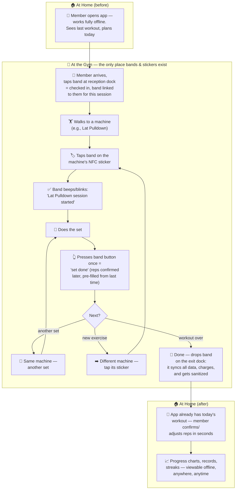
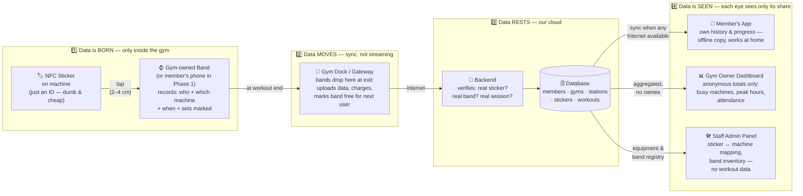
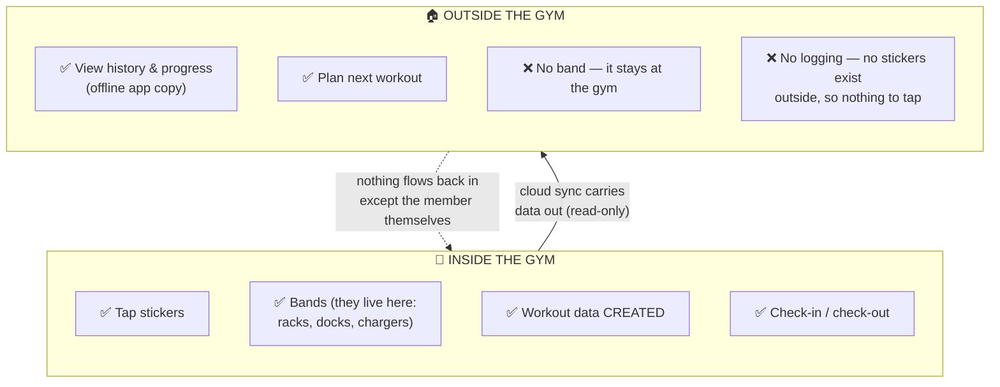

# NFC Gym Band — Decision Log & Scenario Flow

> **Purpose of this document:** You gave the raw idea; the plan changed some things to make it practical. This file lists **every decision taken**, what it changed from your original idea, **why**, and **what you should verify with gyms/gym owners** before locking it in. At the end are diagrams to picturize the full scenario — user flow and data flow.

Companion document: [`PLAN.md`](./PLAN.md) (phases, schedule, risks, metrics).

---

## 1. Locked Constraint (Your Call)

> **The band and NFC stickers are gym-only. The band has no use at home, so it never leaves the gym. The app is offline-capable so members can see their data anywhere.**

This is now a founding constraint, and it makes the product *simpler and better*:

- If the band never goes home, the **gym can own the bands** — members don't buy anything.
- The gym charges/stores/sanitizes bands; members never worry about battery or losing it.
- The band doubles as a **gym check-in token** (tap at entry), which gym owners already understand and value.
- The app splits cleanly into two modes: **"In the gym" = logging** (tap-driven), **"At home" = viewing** (offline cached history, progress, planning next workout).

---

## 2. Decision Log — From Your Idea to the Working Plan

Each row: what you originally imagined → what we decided → why → what to check with the gym.

### D1 — Who reads the sticker

| | |
|---|---|
| **Your idea** | A band detects the sticker when the member comes near it |
| **Decision** | **Phase 1: the member's phone taps the sticker. Phase 3: a gym-owned band taps it.** |
| **Why** | NFC physically works only at 2–4 cm (a tap), and a battery-less sticker cannot announce itself — something must actively read it. Phones already have that reader built in, so we can prove the idea with zero hardware. The band comes only after members prove they'll tap. |
| **Ask the gym** | Are members okay pulling out their phone between sets during a pilot? Do most members carry phones on the floor, or lock them away? *(If most lock phones away, that strengthens the case to reach the band phase quickly.)* |

### D2 — Tap, not "nearby"

| | |
|---|---|
| **Your idea** | Recording starts automatically when the tracker is near the machine |
| **Decision** | **A deliberate tap starts the exercise. Nothing is logged by proximity.** |
| **Why** | "Near a machine" ≠ "using a machine" — members walk past, wait, or chat next to equipment. Proximity would create garbage logs. A tap is a clear "I'm starting THIS now" and also naturally handles two people alternating sets on one machine (each taps with their own band/phone). |
| **Ask the gym** | Watch the floor: how often do members share machines between sets? Where on each machine is a tap spot that's easy to reach but not in the way? |

### D3 — What lives on the sticker

| | |
|---|---|
| **Your idea** | The exercise is written into the sticker, and can be changed/re-added when the sticker moves to another machine |
| **Decision** | **The sticker stores only a permanent unique ID. The meaning (which machine, which exercises) lives in our cloud database, editable from an admin panel in seconds.** |
| **Why** | Re-programming physical stickers every time a machine moves is exactly the kind of manual hassle we're trying to kill. With an ID-only sticker, staff re-map it from a screen without touching the machine. Stickers get write-locked so nobody can tamper with them. |
| **Ask the gym** | How often do machines get moved/replaced/serviced? Who on staff would own the "keep mappings correct" job — and how much effort will they realistically tolerate? *(Answer shapes how automatic the admin panel must be.)* |

### D4 — One sticker per machine, not per exercise

| | |
|---|---|
| **Your idea** | Sticker = the exercise on that machine |
| **Decision** | **Sticker = the station. A station maps to a short exercise list (often just one). Multi-use stations (cables, racks, dumbbell zones) show a mini-list after the tap.** |
| **Why** | A leg press is one exercise, but a cable station is fifteen. The station model covers both without breaking. |
| **Ask the gym** | Get their full equipment list and count: how many single-exercise machines vs multi-use stations vs free-weight zones? *(This tells us how many taps the average workout really needs.)* |

### D5 — Where data can be created vs where it can be seen  ⭐ *(your gym-only rule)*

| | |
|---|---|
| **Your idea** | Data uploads only from the gym network |
| **Decision** | **Workout data can only be *created* in the gym (a real tap on a registered sticker is the proof — optionally backed by a location check). But it can be *viewed* anywhere: the app keeps an offline copy and syncs over any internet.** |
| **Why** | The honest goal behind "gym network only" is authenticity — no fake logs from the couch. The tap itself already proves presence, and it's far more reliable than gym Wi-Fi, which members won't join and which fails often. Meanwhile members absolutely will want to check progress from home — blocking that would kill the app's stickiness. |
| **Ask the gym** | How reliable is the gym's Wi-Fi on the floor? Would they host one small internet-connected device (a sync dock/gateway) if bands need it in Phase 3? |

### D6 — Who owns the band  ⭐ *(new decision from your gym-only rule)*

| | |
|---|---|
| **Your idea** | (Implied) member has a band |
| **Decision** | **Bands are gym property, kept at the gym.** Member taps in at reception → picks up a band (or it's assigned permanently and stored in a rack/locker) → wears it for the workout → drops it back at a charging/sanitizing dock on the way out. The dock syncs data and charges the band overnight. |
| **Why** | Since the band is useless at home, sending it home only creates problems: forgotten bands, dead batteries, lost units. Gym-owned bands mean zero member cost, always charged, always synced, and they double as the gym's check-in system — a feature gym owners already pay for. |
| **Ask the gym** | Would they run a pick-up/drop-off flow at reception, or prefer a self-serve band rack? What's their tolerance for band loss/damage cost? Do they already use RFID check-in cards we could piggyback on? Hygiene expectations — sanitizing between users? |

### D7 — Reps and sets stay manual, but must take 2 seconds

| | |
|---|---|
| **Your idea** | After every set, the member adds the reps/sets done |
| **Decision** | **Kept — but the entry screen is pre-filled with the member's numbers from last time on that machine, so confirming a set is one or two taps, not typing.** Auto rep-counting via motion sensors is a Phase 4 research goal, not a promise. |
| **Why** | This is the last remaining friction. If confirming a set takes 10+ seconds, members quit logging by week two. Pre-fill works because most people repeat or slightly increase their previous numbers. |
| **Ask the gym** | Shadow a few members: between sets, are their hands free? Would they rather log per set, or once at the end per machine? |

### D8 — What the gym owner gets (why they'd pay)

| | |
|---|---|
| **Your idea** | (Not covered — focus was on the member) |
| **Decision** | **Gym owners get an anonymous analytics dashboard: which machines are busiest, dead equipment, peak hours, member engagement — plus the band doubles as their check-in system. This is what they pay the subscription for.** |
| **Why** | Members won't pay in a market full of free logging apps. Gyms will pay for retention and equipment intelligence they currently can't get without buying expensive "smart" machines. Our pitch: smart-gym retrofit at sticker prices. |
| **Ask the gym** | The key question of your whole visit: **"What single number about your gym, seen weekly, would be worth paying for?"** Also: what do they currently pay for member-management/check-in software? |

### D9 — Privacy line

| | |
|---|---|
| **Your idea** | (Not covered) |
| **Decision** | **The member owns their workout data. The gym owner sees only aggregated, anonymous statistics — never an individual's workout unless the member explicitly shares (e.g., with a trainer).** |
| **Why** | Body/fitness data tied to identity is sensitive and regulated. Getting this wrong once destroys trust with both sides. |
| **Ask the gym** | Do their trainers want member-shared data (a paid feature later)? Any existing member-privacy commitments we must fit into? |

### D10 — Step counter parked

| | |
|---|---|
| **Your idea** | Later, add a step counter to the band |
| **Decision** | **Deferred to Phase 4** — and with gym-only bands it matters even less, since nobody counts steps *inside* a gym session. If the Phase 4 band gets a motion chip for rep-counting research, steps come nearly free as an in-gym activity stat. |
| **Why** | Phones and watches already count steps; it would add hardware cost without adding a reason to use the product. |
| **Ask the gym** | Skip it. Not worth spending gym-owner meeting time on. |

---

## 3. The Scenario, Picturized

### 3.1 Full user flow — one gym visit, start to finish (band phase)

*(In the Phase 1 pilot, the same flow runs with the member's **phone** doing the tapping and the reps confirmed on the spot — no band, no docks. The band phase automates the boring parts.)*

### 3.2 Data flow — where data is born, travels, rests, and who sees it

### 3.3 The gym-only boundary — what works where

---

## 4. Your Gym-Visit Checklist (condensed)

Print this. Every question maps to a decision above (D#).

**Watch the floor (no questions needed)**
- [ ] Do members carry phones between sets, or lock them away? (D1)
- [ ] How often do two people alternate on one machine? (D2)
- [ ] Count: single-exercise machines vs multi-use stations vs free-weight zones (D4)
- [ ] Between sets, are members' hands/attention free for a 2-second confirm? (D7)

**Ask the manager/owner**
- [ ] How often does equipment get moved, replaced, serviced? Who'd maintain mappings? (D3)
- [ ] Floor Wi-Fi reliability? Okay hosting one small sync/charging dock? (D5)
- [ ] Band handling: reception pick-up vs self-serve rack? Loss/damage tolerance? Existing RFID check-in to piggyback on? Sanitizing routine? (D6)
- [ ] 💰 **"What single number about your gym, seen weekly, would be worth paying for?"** (D8)
- [ ] What do they pay today for check-in/member-management software? (D8)
- [ ] Do trainers want member-shared workout data? (D9)

**Close with**
- [ ] Would you host a free 8-week pilot with stickers + phone app on ~30 machines? (the Phase 1 gate)

---

*Document version 1.0 — update after the first round of gym visits; each D# gets a "verified / changed / dropped" status.*
