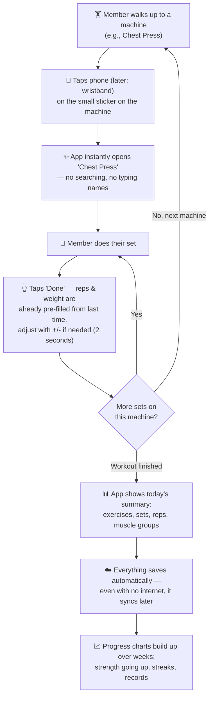
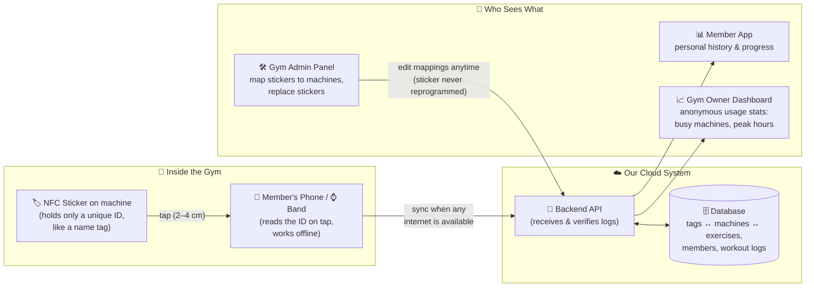
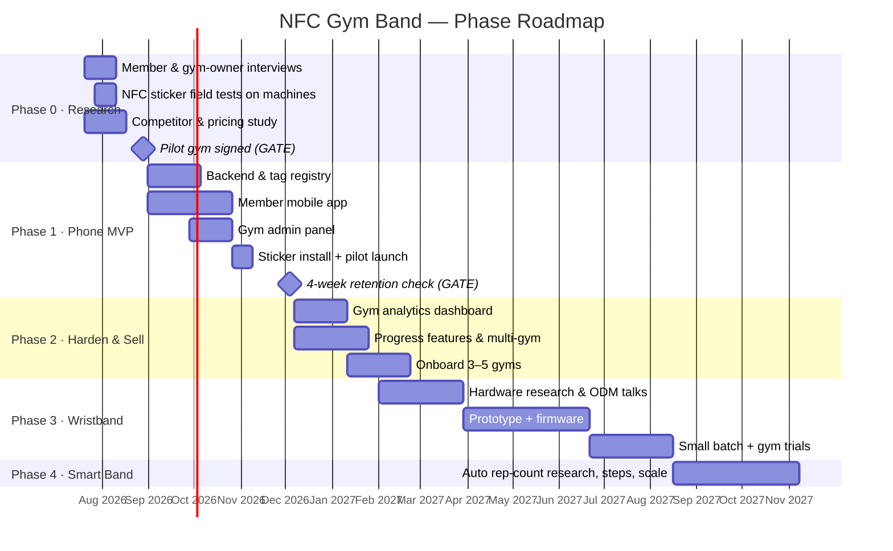

# NFC Gym Band — Product Plan & Roadmap

> **One-line idea:** Put a cheap NFC sticker on every gym machine. When a member taps it (with their phone, and later with a wristband), the app instantly knows *which exercise* they are doing. The member only confirms sets and reps — no more typing exercise names, searching lists, or forgetting what they did.

---

## Table of Contents

1. [The Idea, Restated Simply](#1-the-idea-restated-simply)
2. [Honest Flaw Assessment (and How We Fix Each One)](#2-honest-flaw-assessment-and-how-we-fix-each-one)
3. [The Corrected Concept](#3-the-corrected-concept)
4. [Phase-Wise Plan](#4-phase-wise-plan)
5. [End-to-End Flow Diagrams (Mermaid)](#5-end-to-end-flow-diagrams-mermaid)
6. [Detailed Task Schedule](#6-detailed-task-schedule)
7. [Research Checklist (Do This Before Writing Code)](#7-research-checklist-do-this-before-writing-code)
8. [Tech Stack Suggestion](#8-tech-stack-suggestion)
9. [Risks & Mitigations](#9-risks--mitigations)
10. [Success Metrics](#10-success-metrics)
11. [Open Questions to Answer With a Pilot Gym](#11-open-questions-to-answer-with-a-pilot-gym)

---

## 1. The Idea, Restated Simply

- Every machine in the gym gets a small **NFC sticker** (like a metro card chip, costs almost nothing).
- Each sticker is linked (in our system) to the exercise(s) done on that machine.
- A member **taps** the sticker → our app opens the right exercise automatically.
- After each set, the member taps one or two buttons: *"12 reps, 40 kg, done."*
- Over time we add a **wristband** so members don't even need to pull out their phone, and later a **step counter** inside the band.
- We are not fighting the big fitness-app market head-on. We are making **logging so effortless** inside partner gyms that members and gym owners both want it.

The core value: **remove the annoying part of workout logging (finding/typing the exercise) and keep only the 2-second part (confirming reps).**

---

## 2. Honest Flaw Assessment (and How We Fix Each One)

These are the weak points in the original idea, stated bluntly, each with a practical resolution.

### Flaw 1 — "The band records automatically when it comes NEAR the sticker" — NFC does not work that way

**Problem:** NFC only works at a distance of about **2–4 cm (a deliberate tap)**, not "nearby". Also, a passive NFC sticker **cannot broadcast anything** — it has no battery. Something must actively *read* it. So the band cannot passively "notice" a sticker as you walk past.

**Resolution:**
- Reframe the interaction as a **deliberate tap**, which is actually a *feature*: a tap is an unambiguous signal of intent ("I am starting THIS exercise now"), while proximity would create false logs (walking past a machine ≠ using it).
- If true "nearby" detection is ever wanted, that is **Bluetooth beacons (BLE)**, not NFC — a Phase 3+ experiment, not the foundation.

### Flaw 2 — Building a custom NFC-reading band first is the most expensive, slowest possible start

**Problem:** A band that *reads* NFC tags needs an active NFC reader chip, battery, charging, firmware, enclosure, certifications (FCC/CE/BIS), and manufacturing. That is 12–18 months and serious money — before we even know if anyone wants this.

**Resolution:**
- **Phase 1 uses the member's phone as the reader.** Almost every Android phone (and iPhone 7+) can read NFC tags natively. Zero hardware cost, we validate the whole idea with just stickers + an app.
- The custom band becomes **Phase 3**, built only after the phone-tap MVP proves people actually use it.

### Flaw 3 — The main pain (entering reps/sets) is still manual

**Problem:** The idea removes *exercise selection* friction, but the member still types reps/sets/weight. If that entry is clunky, we've only saved a small part of the hassle.

**Resolution:**
- Make rep entry a **2-second interaction**: big "+/-" steppers pre-filled with the member's *last session's numbers* for that machine (most people repeat or slightly progress their numbers).
- One-tap "same as last set" button.
- Later (Phase 4): experiment with **motion-sensor (IMU) rep counting** in the band so reps become automatic too.

### Flaw 4 — One sticker ≠ one exercise (free weights, cables, multi-use stations)

**Problem:** A leg press machine maps to one exercise. But a cable station supports 15 exercises, and dumbbells support 50. A strict "1 sticker = 1 exercise" model breaks immediately.

**Resolution:**
- A sticker maps to a **station**, and a station maps to a **short list of exercises** (often just one). Tapping shows the list; one more tap picks the exercise. For single-exercise machines it's still zero extra taps.
- Free-weight zones get a **zone sticker** on the rack ("Dumbbell Area") that opens a filtered mini-list.

### Flaw 5 — Stickers live a hard life and mappings go stale

**Problem:** Gym equipment gets sweat, disinfectant sprays, and abuse. Machines get moved, replaced, or re-purposed. If the sticker's data lives *on the sticker*, every change means physically reprogramming tags. Tags can also be vandalized or maliciously rewritten.

**Resolution:**
- The sticker stores **only a permanent unique ID** (or a URL containing that ID). All meaning (gym, machine, exercise list) lives in **our cloud database**, editable in seconds from a gym-admin panel — no touching the sticker ever again.
- Lock the tags (write-protect) after encoding; use tamper-evident, waterproof industrial tags (~on-metal NTAG213/216 variants, since gym machines are metal — ordinary tags fail on metal surfaces).
- Admin panel includes a "re-map / replace sticker" flow for staff.

### Flaw 6 — "Data uploads only from the gym network" hurts more than it helps

**Problem:** Gym Wi-Fi is often unreliable; members won't connect to it; and members will rightfully expect to *view* their history from home. Locking uploads to one network creates sync failures and support tickets, with little real benefit.

**Resolution:**
- **Offline-first app:** every log is saved on the device instantly and synced to the cloud whenever any internet is available.
- What actually matters for trust is *"was this log created by a real tap in the gym?"* — enforce that with **tap-time verification** (the tag read event itself), not with network restrictions.
- If gyms want geo-assurance, add optional location check at tap time — not a network lock.

### Flaw 7 — Two people, one machine (sharing sets / working in)

**Problem:** Gym-goers commonly alternate sets on the same machine. If "nearby = logging", both users' data collides.

**Resolution:** The deliberate-tap model already solves this — each person taps with **their own phone/band**, creating separate sessions. A session stays "open" on the member's device, so alternating users never conflict.

### Flaw 8 — "The market is well built" cuts both ways

**Problem:** Hevy, Strong, Jefit already do slick manual logging; Technogym/eGym already do machine-connected tracking (but require buying *their* expensive machines). We must be clear about our wedge.

**Resolution:** Our differentiation is a **retrofit**: any gym, any brand of machine, upgraded to "smart logging" for the price of stickers (~₹50–100 / $1 per machine) instead of lakhs per connected machine. Sell **B2B2C**: the gym pays a small subscription, members get the app free (or the gym white-labels it). Gym owners get an analytics dashboard (equipment usage, peak hours, dead machines) — data they cannot get today without expensive hardware.

### Flaw 9 — Step counter is a distraction (for now)

**Problem:** Every phone and every smartwatch already counts steps; nobody buys a gym band for steps. Adding it early bloats hardware scope.

**Resolution:** Keep it in Phase 4 as a "nice extra" once the band exists anyway (the IMU chip used for rep-detection experiments gives step counting nearly for free). It is never the selling point.

### Flaw 10 — Privacy and consent

**Problem:** We are recording where a person is and what they do with their body, tied to identity. That is sensitive personal data (and regulated — e.g., India's DPDP Act, GDPR if abroad).

**Resolution:** Explicit consent at signup; members own and can export/delete their data; gym owners see only **anonymized, aggregated** equipment analytics, never an individual member's workout unless the member opts in (e.g., sharing with a trainer).

---

## 3. The Corrected Concept

Putting all resolutions together, the plan becomes:

| Aspect | Original idea | Corrected plan |
|---|---|---|
| Reader | Custom band reads stickers "nearby" | **Phase 1:** member's phone taps sticker → **Phase 3:** wristband taps sticker |
| Sticker contents | Exercise written on the sticker | Sticker holds only an **ID**; meaning lives in the cloud, editable anytime |
| Trigger | Passive proximity | **Deliberate tap** (unambiguous intent, no false logs) |
| Reps/sets | Manual entry | 2-second smart entry (pre-filled from last session) → later auto rep-counting experiments |
| Upload | Gym network only | **Offline-first**, sync anywhere; authenticity via tap verification |
| Hardware | Band first | Band **only after** phone MVP proves demand |
| Business | Consumer app in a crowded market | **B2B2C gym retrofit** + gym analytics dashboard |

---

## 4. Phase-Wise Plan

### Phase 0 — Research & Validation *(Weeks 1–6, no code)*
**Goal: prove the problem is worth solving before building anything.**
- Interview 15–20 gym members: do they log workouts? What annoys them? Would they tap?
- Interview 3–5 gym owners/managers: would they pay for member engagement + equipment analytics? Line up **one pilot gym** (letter of intent).
- Competitor teardown: Hevy, Strong, Jefit (consumer); eGym, Technogym (B2B); any local NFC gym startups.
- Hands-on NFC feasibility: buy 20 on-metal NTAG213 stickers, test read reliability on actual machines (metal, sweat, angles) with 5 different phones (Android + iPhone).
- Decide pricing hypothesis (per-gym monthly subscription).
- **Gate to Phase 1:** 1 pilot gym committed **and** stickers read reliably on real machines.

### Phase 1 — MVP: Stickers + Phone App *(Weeks 7–18)*
**Goal: a member in the pilot gym taps a sticker and logs a full workout in under 10 seconds per set.**
- Mobile app (member): tap-to-open exercise, set/rep/weight quick entry, workout history, offline-first sync.
- Backend: accounts, gyms, stations, tag registry, workout logs API.
- Admin web panel (gym staff): register stickers, map to machines/exercises, replace/re-map flow.
- Encode + lock + install stickers on ~30 machines in pilot gym.
- **Gate to Phase 2:** ≥40% of onboarded pilot members still logging weekly after 4 weeks.

### Phase 2 — Pilot Hardening & Gym Value *(Weeks 19–30)*
**Goal: make the gym owner love it and the product scale-ready.**
- Gym analytics dashboard: machine usage heatmap, peak hours, idle equipment.
- Member progress features: personal records, muscle-group weekly summary, streaks.
- Multi-gym support, white-label branding option, staff roles.
- Onboard 3–5 more gyms; formalize pricing.
- **Gate to Phase 3:** paying gyms + clear member demand for "I don't want to carry my phone between sets".

### Phase 3 — The Wristband *(Months 8–16, overlaps Phase 2 tail)*
**Goal: phone-free tapping.**
- Hardware R&D: nRF52-class chip (BLE + NFC), battery, strap, enclosure; or partner with an existing wearable ODM (strongly consider **buy/partner over build**).
- Band taps sticker → stores events → syncs to member's phone via Bluetooth when in range (or to a gym gateway).
- One button / simple squeeze gesture on band = "set done" (reps confirmed on phone later, pre-filled).
- Small manufacturing pilot (100–200 units) for pilot gyms; certifications.
- **Gate to Phase 4:** band retention ≥ phone-app retention in pilot.

### Phase 4 — Smart Band & Scale *(Month 16+)*
- IMU-based automatic rep counting (research project — ship only if accuracy > ~90%).
- Step counting (free by-product of the IMU) and general activity summary.
- Trainer features (member shares data with coach), gym chains, integrations (Google Fit / Apple Health export).

---

## 5. End-to-End Flow Diagrams (Mermaid)

### 5.1 What the Member Experiences (Layman View)

### 5.2 How the System Works Behind the Scenes

### 5.3 Roadmap at a Glance

---

## 6. Detailed Task Schedule

### Phase 0 (Weeks 1–6) — Research

| # | Task | Owner | Week | Output |
|---|------|-------|------|--------|
| 0.1 | Draft interview scripts (members & owners) | Founder | 1 | Script docs |
| 0.2 | Interview 15–20 gym members | Founder | 1–3 | Pain-point summary |
| 0.3 | Interview 3–5 gym owners, pitch pilot | Founder | 2–4 | 1 signed pilot LOI |
| 0.4 | Buy & field-test on-metal NFC tags (5 phone models, sweat/cleaner exposure) | Tech | 2–3 | Tag spec decision |
| 0.5 | Competitor teardown (Hevy/Strong/Jefit/eGym/Technogym) | Founder | 1–4 | Positioning doc |
| 0.6 | Data-privacy & consent requirements note (DPDP/GDPR) | Tech | 4 | Compliance checklist |
| 0.7 | Pricing hypothesis + simple financial model | Founder | 5–6 | Pricing one-pager |
| 0.8 | **GO/NO-GO gate review** | All | 6 | Decision |

### Phase 1 (Weeks 7–18) — Build MVP

| # | Task | Owner | Weeks | Output |
|---|------|-------|-------|--------|
| 1.1 | Data model: gyms, stations, tags, exercises, members, sessions, sets | Backend | 7–8 | Schema + API design |
| 1.2 | Backend API + auth + offline-sync endpoints | Backend | 8–12 | Deployed API |
| 1.3 | Mobile app: NFC tap → exercise screen (Android first, then iOS) | Mobile | 8–14 | App beta |
| 1.4 | Quick-entry UX: pre-filled sets/reps/weight, "same as last set" | Mobile | 12–14 | Usability-tested flow |
| 1.5 | Offline-first storage & background sync | Mobile | 13–15 | Sync works with airplane mode |
| 1.6 | Gym admin panel: register/map/replace stickers | Web | 12–15 | Admin panel |
| 1.7 | Encode, lock & install ~30 stickers in pilot gym | Tech | 15–16 | Live gym |
| 1.8 | Pilot launch: onboard 30–50 members, weekly feedback loop | All | 16–18 | Usage data |
| 1.9 | **Retention gate review (week 22, after 4 weeks of data)** | All | 22 | Decision |

### Phase 2 (Weeks 19–30) — Harden & Sell
Key tasks: analytics dashboard (2a), PR/streak/muscle-summary features (2b), multi-gym & white-label (2c), sales to 3–5 gyms (2d), support & sticker-maintenance playbook (2e).

### Phase 3 (Months 8–16) — Wristband
Key tasks: build-vs-partner decision (3a), prototype with BLE+NFC chip (3b), firmware: tap capture, buffer, BLE sync (3c), enclosure & strap (3d), certification (3e), 100–200 unit pilot batch (3f).

### Phase 4 (Month 16+) — Smart Band
Key tasks: IMU rep-count research (4a), step counter (4b), trainer sharing (4c), health-platform export (4d), chain-gym scale (4e).

---

## 7. Research Checklist (Do This Before Writing Code)

- [ ] **Tag hardware:** on-metal NTAG213 vs NTAG216; adhesive quality; sweat/chemical resistance; read reliability through machine padding.
- [ ] **Phone coverage:** % of target members with NFC-capable phones (iPhone background tag reading behavior vs in-app scan; Android foreground dispatch).
- [ ] **Tap-to-app flow:** NFC tag as URL (opens app via deep link / App Clip / Instant App) vs raw ID read inside app — which gives the smoothest "tap → exercise on screen" experience.
- [ ] **Anti-abuse:** tag write-lock, optional NTAG signature check, duplicate-tap debounce.
- [ ] **Gym economics:** what a gym pays today for engagement tools; churn cost of a member; what analytics they'd pay for.
- [ ] **Legal:** consent flow, data retention, member data export/delete (DPDP Act; GDPR if expanding).
- [ ] **Wristband landscape (for Phase 3 later):** existing ODM bands with NFC reader capability vs ground-up build cost.

---

## 8. Tech Stack Suggestion

| Layer | Suggestion | Why |
|---|---|---|
| Mobile app | React Native or Flutter (with native NFC modules) | One codebase, both platforms; NFC plugins are mature |
| Backend | Node.js/TypeScript (NestJS/Next.js API) or Python (FastAPI) | Fast to build, easy to hire for |
| Database | PostgreSQL | Relational fit (gyms→stations→tags→logs) |
| Sync | Offline queue on device + idempotent sync API | Gym connectivity is unreliable |
| Admin & dashboard | Next.js web app | Shared components, quick iteration |
| Hosting | Managed cloud (Vercel/Render/AWS) | No ops burden at pilot scale |
| Tags | NTAG213/216 **on-metal** stickers, write-locked | Cheap (~$0.5–1), standard, phone-readable |
| Band (Phase 3) | nRF52-family SoC (BLE + NFC) or ODM partner | Industry standard for low-power wearables |

---

## 9. Risks & Mitigations

| Risk | Likelihood | Impact | Mitigation |
|---|---|---|---|
| Members don't change habit (won't tap) | Medium | Fatal | Phase 0 interviews + Phase 1 retention gate before any hardware spend |
| iPhone NFC UX friction (in-app scan sheet) | Medium | Medium | Use URL-encoded tags + App Clips; Android-first pilot |
| Stickers fail on metal/sweat | Low (with right tags) | High | On-metal industrial tags, field-tested in Phase 0 |
| Gym won't pay | Medium | High | Analytics dashboard as owner-side value; cheap retrofit pitch |
| Hardware phase burns cash | High (if rushed) | Fatal | Band gated behind proven phone MVP; prefer ODM partner |
| Big player copies us | Medium | Medium | Speed + gym relationships + retrofit price point |
| Privacy incident | Low | High | Minimal data, aggregation for owners, consent-first design |

---

## 10. Success Metrics

| Phase | Metric | Target |
|---|---|---|
| 0 | Pilot gyms signed | ≥ 1 |
| 1 | Time to log one set | ≤ 10 seconds |
| 1 | Weekly active logging retention (week 4) | ≥ 40% |
| 2 | Paying gyms | ≥ 3 |
| 2 | Member NPS | ≥ 40 |
| 3 | Band vs phone retention | Band ≥ phone |
| 4 | Auto rep-count accuracy | ≥ 90% before shipping |

---

## 11. Open Questions to Answer With a Pilot Gym

1. Do members prefer tapping *before* the first set or logging everything *after* the last set?
2. Where exactly on each machine should the sticker sit (reachable, visible, not where hands sweat most)?
3. Will the gym's staff realistically maintain sticker mappings, or must it be near-zero-touch?
4. What single dashboard number would make a gym owner renew the subscription?
5. Is white-labeling (gym's own brand on the app) a deal-maker or a nice-to-have?

---

*Document version 1.0 — living document; update at each phase gate.*
